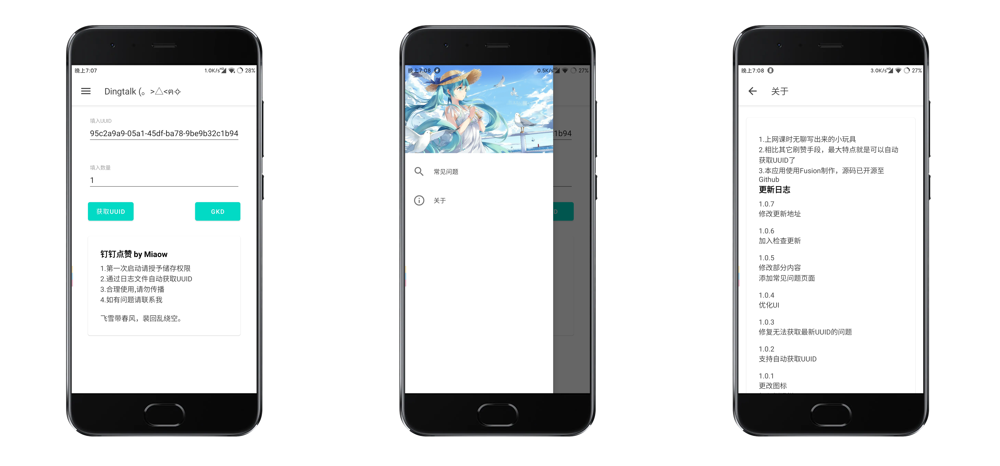

# 由于点赞接口限制，功能暂时失效

# Dingtalk_createLike 

一个钉钉点赞小工具，使用 `FusionApp` 制作，轻松上21亿

## 功能&特性
1. 支持手机端无抓包自动获取直播间UUID，*通过读取log文件实现*
2. 可自定义点赞数量

## Todo
- [X] 检查更新
- [ ] 使用限制
- [ ] 使用 `Java` 重写
- [ ] 添加应用悬浮窗

## 开发
下载安装 [`FusionApp 2.x`](https://github.com/Miaow233/Dingtalk_createLike/releases/download/1.0.4/FusionApp_2.0.0-beta8.7.2.apk) 版本

将本项目文件导入 `FusionApp projects` 目录 `/storage/emulated/0/Android/data/net.fusionapp/files/projects/`

打包安装

## Licenses
[MIT](https://mit-license.org)

本项目仅供学习参考
